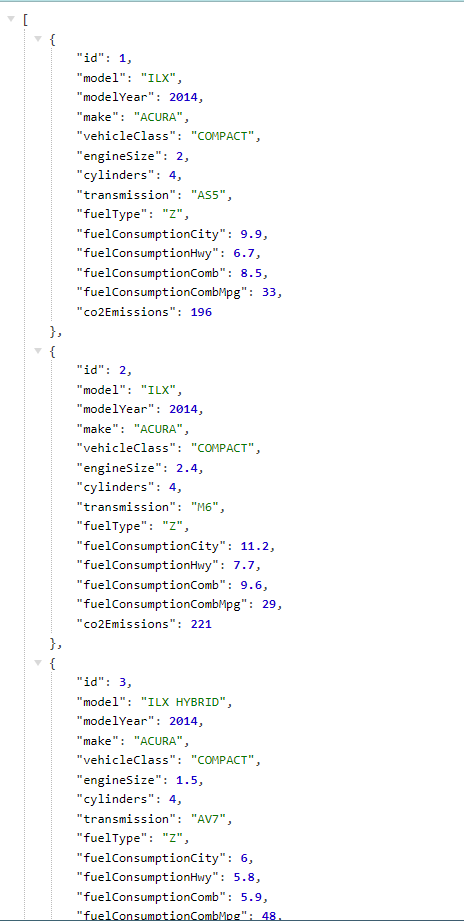

# Batch Cars CO2 Emission

This project is a Spring Boot application for managing car data and calculating CO2 emissions using Spring Batch.

## Dependencies

- [Spring Boot Starter Batch](https://mvnrepository.com/artifact/org.springframework.boot/spring-boot-starter-batch)
- [Spring Boot Starter Data JPA](https://mvnrepository.com/artifact/org.springframework.boot/spring-boot-starter-data-jpa)
- [Spring Boot Starter Web](https://mvnrepository.com/artifact/org.springframework.boot/spring-boot-starter-web)
- [Spring Boot DevTools](https://mvnrepository.com/artifact/org.springframework.boot/spring-boot-devtools)
- [H2 Database](https://mvnrepository.com/artifact/com.h2database/h2)
- [Project Lombok](https://mvnrepository.com/artifact/org.projectlombok/lombok)
- [Spring Boot Starter Test](https://mvnrepository.com/artifact/org.springframework.boot/spring-boot-starter-test)
- [Spring Batch Test](https://mvnrepository.com/artifact/org.springframework.batch/spring-batch-test)

## Screenshots

  
 
